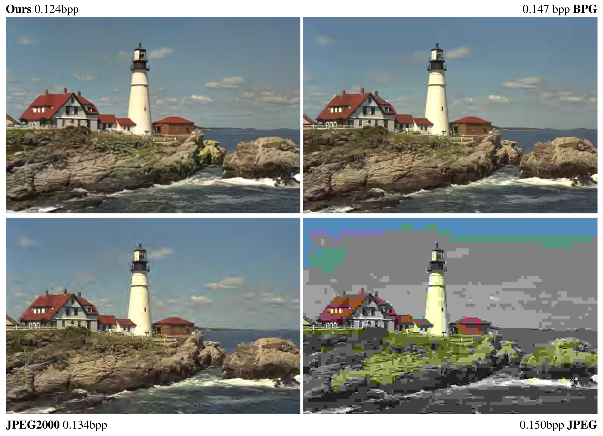
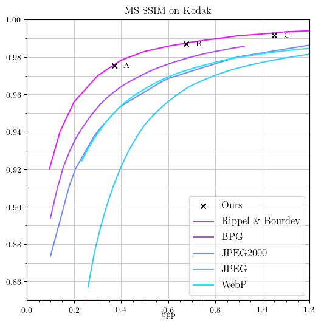

# Conditional Probability Models for Deep Image Compression

<p align='center'>
  
</p>

### [[Paper]](https://arxiv.org/pdf/1801.04260) [[Citation]](#citation)

TensorFlow implementation of **Conditional Probability Models for Deep Image Compression**, published in CVPR 2018.


## Prerequisites

- [Download checkpoints here](http://data.vision.ee.ethz.ch/mentzerf/imgcomp-ckpts/ckpts.tar.gz) and extract them to
`ckpts`
- Python 3 (tested with Python 3.4.5)
- TensorFlow (tested with tensorflow-gpu version 1.4.1)
- Python packages as specified by requirements.txt (`pip install -r requirements.txt`)
- A CUDA-compatible GPU

## Inference



NOTE: Inference only works on CUDA-compatible GPUs.

---

To do inference, use the following command

    python val.py ../ckpts MODEL_ID DATASET --save_ours

where `MODEL_ID` is one of

- `0515_1103`: Point **A** in the plot (on Kodak: bpp: 0.370, MS-SSIM: 0.975)
- `0515_1309`: Point **B** in the plot (on Kodak: bpp: 0.677, MS-SSIM: 0.987)
- `0515_1310`: Point **C** in the plot (on Kodak: bpp: 1.051, MS-SSIM: 0.992)

and `DATASET` is either the path to a directory of png files or an escaped glob (e.g., `some/images/\*/\*.jpg`). All
images readable with PIL should be supported.

This will save outputs in `ckpts/MODEL_ID\ DATASET/imgs` and display the mean bpp and MS-SSIM on console.
Detailed measures per image are written to `ckpts/MODEL_ID\ DATASET/measures.csv`. Note that some images may be padded.

### Encoding to bitstream

By default, `val.py` will use cross entropy to estimate the actual bitrate. In our experiments, this is very close to
 the real bitrate (<0.1\% difference for most images). But to evaluate this yourself, you can use

    python val.py ../ckpts MODEL_ID DATASET --save_ours --real_bpp

which will use an arithmetic encoder to write the symbols of an image to a file, count the number of bits, and then
decode the bits to restore the symbols. We note that this is not optimized at all (images from the Kodak validation
set take ~350s to encode and ~200s to decode). For a practical
implementation,
the following should be done:
- A faster arithmetic encoder should be used (we use the clean but non-optimized code from
[here](https://github.com/nayuki/Reference-arithmetic-coding)).
- The probability classifier network should output the logits for all symbols in parallel, instead of sequentially.
- Decoding should re-use activations, as in [Fast PixelCNN++](https://github.com/PrajitR/fast-pixel-cnn), which
achieves speedups of up to 183x.
- Like in classical approaches, the image could be split into blocks and those blocks could be encoded in parallel.

### Plot

The plot above was created using

    python plotter.py ../ckpts 0515_1103,0515_1309,0515_1310 kodak --style mean --ids A B C --latex

For reference, the curve corresponding to our model in Fig. 1 in the paper can be reproduced with the following data:

    # bpp -> MS-SSIM on Kodak
    CVPR_FIG1 = [
        (0.1265306, 0.9289356),
        (0.1530612, 0.9417454),
        (0.1795918, 0.9497924),
        (0.2061224, 0.9553684),
        (0.2326531, 0.9598574),
        (0.2591837, 0.9636625),
        (0.2857143, 0.9668663),
        (0.3122449, 0.9695684),
        (0.3387755, 0.9718446),
        (0.3653061, 0.9738012),
        (0.3918367, 0.9755308),
        (0.4183673, 0.9770696),
        (0.4448980, 0.9784622),
        (0.4714286, 0.9797252),
        (0.4979592, 0.9808753),
        (0.5244898, 0.9819255),
        (0.5510204, 0.9828875),
        (0.5775510, 0.9837722),
        (0.6040816, 0.9845877),
        (0.6306122, 0.9853407),
        (0.6571429, 0.9860362),
        (0.6836735, 0.9866768),
        (0.7102041, 0.9872690),
        (0.7367347, 0.9878184),
        (0.7632653, 0.9883268),
        (0.7897959, 0.9887977),
        (0.8163265, 0.9892346),
        (0.8428571, 0.9896379)]

## Training

If you want to train on the ImageNet dataset as described in the paper, follow the steps below (_Prepare ImageNET_). After doing
this,
you can pass `--dataset_train imgnet_train --dataset_test imgnet_test` to `train.py` (make sure you set `$RECORDS_ROOT` for this,
see below). Otherwise, set `--dataset_train` and `--dataset_test`
to an escaped glob matching images files (e.g. `some/images/\*/\*.jpg`).

    python train.py ae_configs/cvpr/AE_CONFIG pc_configs/cvpr/PC_CONFIG \
            --dataset_train TRAIN_DATASET \
            --dataset_test TEST_DATASET \
            --log_dir_root LOG_DIR_ROOT

where `AE_CONFIG` and `PC_CONFIG` are one of the configs in the respective folders. The models in `ckpts` where
obtained with the following configs:

- `0515_1103`: `ae_configs/cvpr/low` `pc_configs/cvpr/res_shallow`
- `0515_1309`: `ae_configs/cvpr/med` `pc_configs/cvpr/res_shallow`
- `0515_1310`: `ae_configs/cvpr/high` `pc_configs/cvpr/res_shallow`

Various options are available for `train.py`, such as `--restore` to continue training from a previous checkpoint.
See `python train.py -h`.


## Prepare ImageNET

The following instructions assume that you have the following tools installed:
- GNU parallel (you can do without but it might take a really long time. Installing should be as simple as
`(wget -O - pi.dk/3 || curl pi.dk/3/ || fetch -o - http://pi.dk/3) | bash`,
see e.g.
[here](https://github.com/mfragkoulis/parallel/blob/master/README))
- [ImageMagick](https://www.imagemagick.org/script/index.php) to downscale images to 256 pixels
- `fjcommon` (`pip install fjcommon`) to create TF Records

Note that creating all records will likely take several hours. Note that the following was tesed using `zsh`.

### 1. Get ImageNET, in the proper format

You need to download `ILSVRC2012_img_train.tar` and `ILSVRC2012_img_val.tar` (a good resource is the
[Inception `download_imagenet.sh` script](https://github.com/tensorflow/models/blob/master/research/inception/inception/data/download_imagenet.sh)). For the following instructions, we assume both tar files are located in a directory `data`.

```bash
    # in data/

    mkdir train val

    pushd train
    tar xvf ../ILSVRC2012_img_train.tar
    popd

    pushd val
    tar xvf ../ILSVRC2012_img_val.tar
    popd
```

This will unpack to 1000 .tar containers into `train/` and 50000 .JPEG images into `val/`. Now, we need to extract the
training images. This may take a while depending on your setup.

```bash
    # in data/
    pushd train
    find . -name "n*.tar" | parallel -j64 'mkdir -vp {/.} && tar xf {} -C {/.}'
    popd
```


### 2. Downsample

We downsample each image to have 256 pixels on the shorter side, by executing the following command in `data/`. Again,
 this is very time-consuming, so if you have access to some CPU cluster, it might make sense to run it there.

```bash
    # in data/
    find . -name "*.JPEG" |  parallel -j64 convert -verbose {} -resize "256x256^" {}
```

### 3. Create records


Now it's time to pack the images into TF record files. We will save them in `data/records/`:

```bash
    # in data/
    mkdir -p records/train
    mkdir -p records/val

    pushd train
    find . -name "*.JPEG" | parallel --bar -j64 -N 1250 \
        'OUTPUT_PATH=$(printf "../records/train/train-%05d.tfrecord" {#});' \
        'python -m fjcommon tf_records mk_img_rec {} -o $OUTPUT_PATH --feature_key image/encoded'
    popd

    pushd val
    find . -name "*.JPEG" | parallel --bar -j16 -N 1250 \
        'OUTPUT_PATH=$(printf "../records/val/val-%05d.tfrecord" {#});' \
        'python -m fjcommon tf_records mk_img_rec {} -o $OUTPUT_PATH --feature_key image/encoded'
    popd
```


### 4. Set RECORDS_ROOT

Make sure the following environment variable is set before running `train.py`:

```bash
    export RECORDS_ROOT=path_to_data/records
```


## Citation

If you use this code for your research, please cite this paper:

    @inproceedings{mentzer2018conditional1,
        Author = {Mentzer, Fabian and Agustsson, Eirikur and Tschannen, Michael and Timofte, Radu and Van Gool, Luc},
        Booktitle = {Proceedings of the IEEE Conference on Computer Vision and Pattern Recognition (CVPR)},
        Title = {Conditional Probability Models for Deep Image Compression},
        Year = {2018}}

